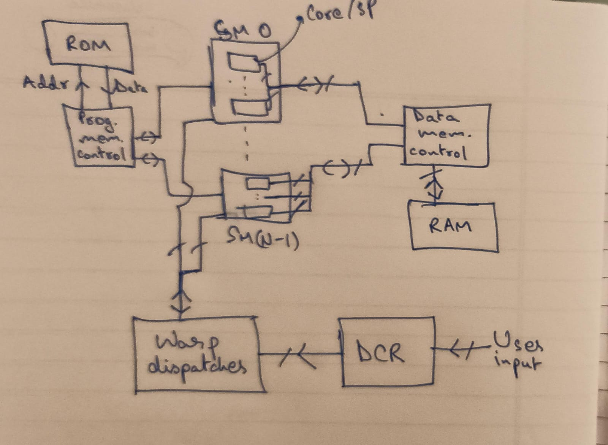
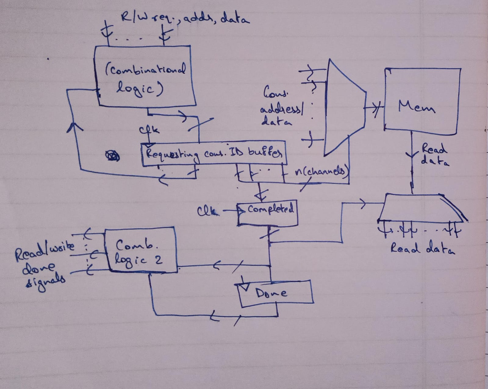
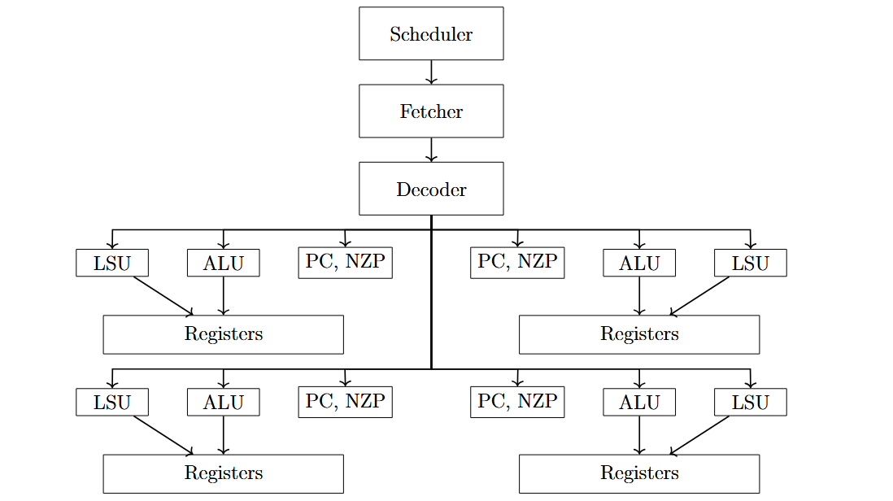

This is meant to be an extremely basic GPU for personal learning. Started as Seasons of Code project (Web and Coding Club, IITB: summer progress submission at SoCREADME.md).

A rough high-level overview of the design is given below

More or less, I have followed basic CUDA terminology
    The DCR reads user inputs, setting the number of blocks and threads to process.
    The dispatcher sends 'blocks' to each multiprocessor.
    Each multiprocessor, in this basic GPU, can handle only n(cores) threads at a time. So warp size is is n(cores).
    Both data and program memory have, in general, more consumers than channels. We need controllers to hold requests in buffer.

An extremely rough high-level design for the memory controller, omitting some key parts (most importantly registers holding the lengths of the buffers which are used in the combinational logic)

Instructions are 16 bits long and are given as below. This needs more work.

|Mnemonic|Encoding|Interpretation|
|-|-|-|
|NOP|`0000 xxxx xxxx xxxx`|Program counter `PC -> PC + 1`|
|BRNZP| `0001 nzpx iiii iiii`|If `nzp` is satisfied, `PC -> iiii iiii` (8-bit immediate line value)|
|CMP|`0010 xxxx ssss tttt`|Set the NZP register the value of the comparison between the values in `ssss` and `tttt` registers|
|ADD|`0011 dddd ssss tttt`|Register `Rd -> Rs + Rt`|
|SUB|`0100 dddd ssss tttt`|Register `Rd -> Rs - Rt`|
|MUL|`0101 dddd ssss tttt`|Register `Rd -> Rs * Rt`|
|DIV|`0110 dddd ssss tttt`|Register `Rd -> Rs / Rt`|
|LDR|`0111 dddd ssss xxxx`|Register `Rd -> Mem[Rs]`|
|STR|`1000 xxxx ssss tttt`|Memory `Mem[Rs] -> Rt`|
|CONST|`1001 dddd iiii iiii`|Register `Rd -> immediate`|
|BAND|`1010 dddd ssss tttt`|Register `Rd -> Rs & Rt`|
|BOR|`1011 dddd ssss tttt`|Register `Rd -> Rs \| Rt`|
|BXOR|`1100 dddd ssss tttt`|Register `Rd -> Rs ^ Rt`|
|BNOT|`1101 dddd ssss xxxx`|Register `Rd -> ~Rs`|
|RET|`1111 xxxx xxxx xxxx`|Return (end)|

Above, the scheduler sets the FSM state of the SM, fetcher retreives the program line from the memory controller, and the decoder parses these instructions and sets the control signals for the RF, ALU, LSU and PC/NZP in the core. The multiple PCNZPs are in fact redundant in this implementation, as I have not designed for threads with in a block for to be able to diverge. This should be an easy addition.

TODO: increase size of memory and registers. Far too small.