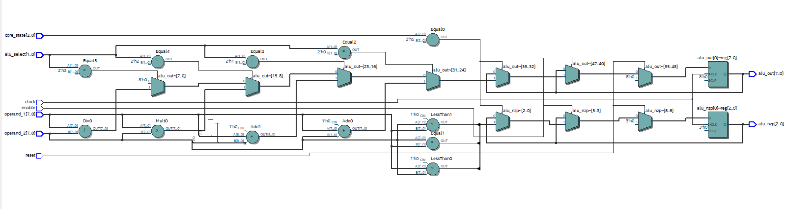
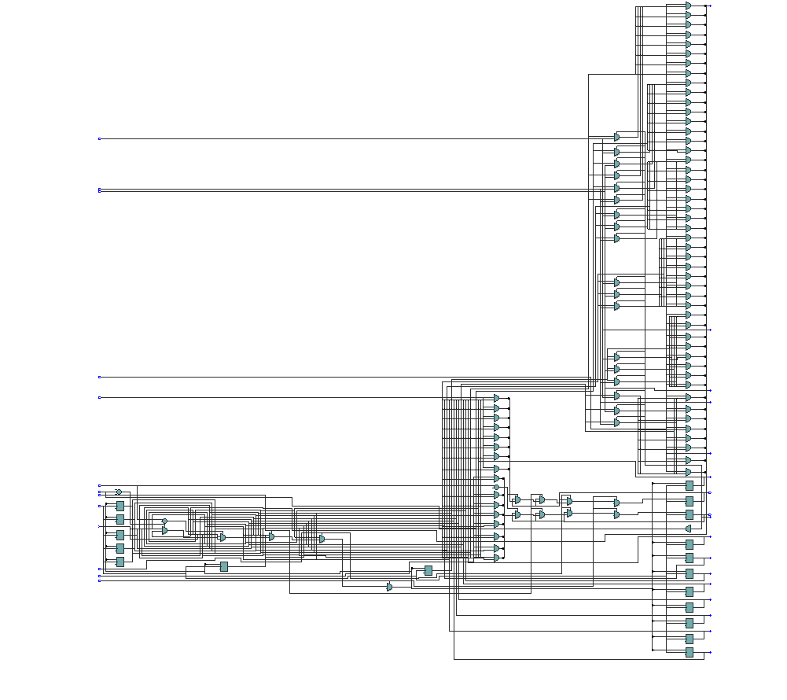
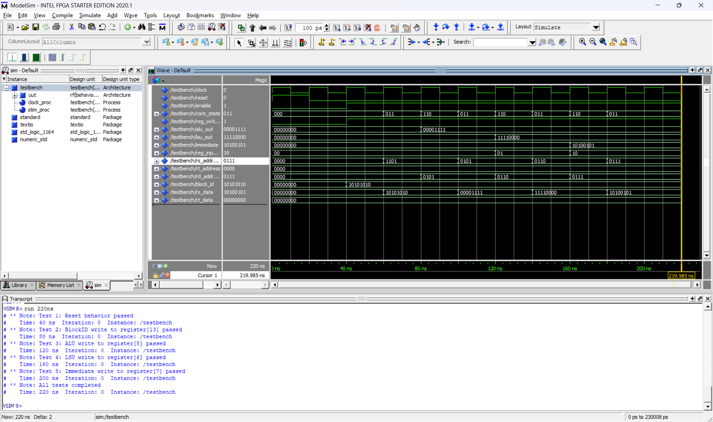
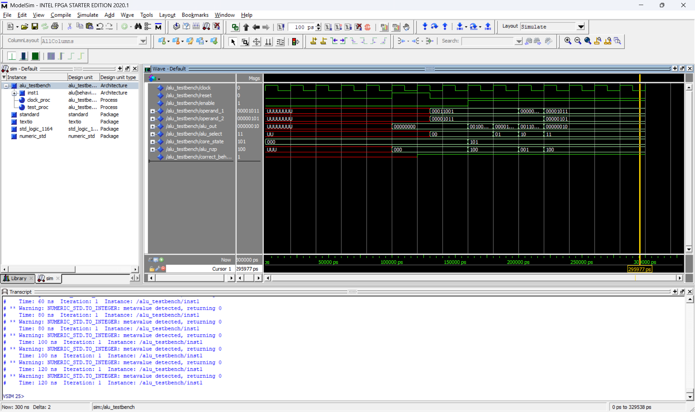
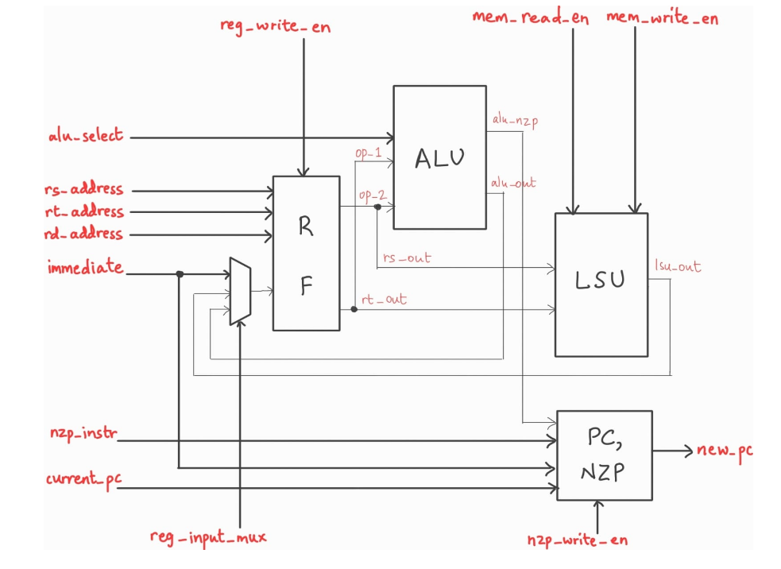
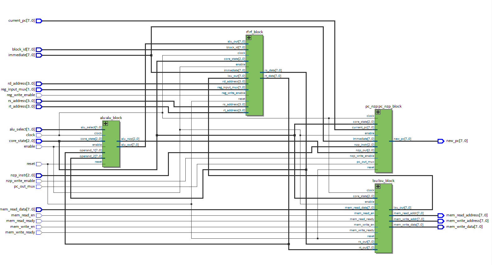

# Week 1 and 2
Learnt the basics of VHDL, made simple designs of an n-bit adder, a multiplexer, a demultiplexer and a decoder, understood hierarchies and made some testbenches in Quartus.
# Week 3
Went through the architecture of miniMIPS to get a feel of how a CPU can read and parse programs. Read through single-cycle and multi-cycle data paths. Tried to implement some version of a register file on my own (miniMIPS/src/reg_1b.vhd, mem_unit.vhd, not used anywhere as I ended up implementing the architecture suggested by the mentor).
# Week 4
Implemented a register file and an ALU in VHDL. The RTL netlist appears as:

The mentors provided us with testbenches. With some modifications to the code, the results are:
* RF testbench ran successfully (with the code in miniMIPS/src/rf_tb.vhd). Clock cycle 20 ns, 5 tests were run. 
    * Test 1: Reset set to 1 should set all values to 0: passed
    * Tests 2, 3, 4, 5: BlockID write, ALUWrite, LSUWrite and immediate value write to particular registers were successful. 
* ALU testbench ran successfully (miniMIPS/src/alu_tb.vhd). 
    * Addition, subtraction, division and multiplication operations successfully carried out on the input bytes. When the operands are 'U' (uninitialised) the input is also such and this is the expected behaviour. 
# Week 5
Implemented a program counter (PC) and Load-Store Unit (LSU), and assembled the RF, ALU, PC and LSU together to form a unit capable of taking in signals derived from a single line in the program and giving out the memory read/write instruction as well as the next program line number.

# Week 6
Read resources about SIMD and GPU architecture.
# Week 7
Currently in the process of implementing the following preliminary instruction set for the GPU core:
x denotes we 'don't care' about those bits.
|Mnemonic|Encoding|Interpretation|
|-|-|-|
|NOP|`0000 xxxx xxxx xxxx`|Program counter `PC -> PC + 1`|
|BRNZP| `0001 nzpx iiii iiii`|If `nzp` is satisfied, `PC -> iiii iiii` (8-bit immediate line value)
|CMP|`0010 xxxx ssss tttt`|Set the NZP register the value of the comparison between the values in `ssss` and `tttt` registers|
|ADD|`0011 dddd ssss tttt`|Register `Rd -> Rs + Rt`|
|SUB|`0100 dddd ssss tttt`|Register `Rd -> Rs - Rt`|
|MUL|`0101 dddd ssss tttt`|Register `Rd -> Rs * Rt`|
|DIV|`0110 dddd ssss tttt`|Register `Rd -> Rs / Rt`|
|LDR|`0111 dddd ssss xxxx`|Register `Rd -> mem[Rs]`|
|STR|`1000 xxxx ssss tttt`|Store val of `Rt` in `mem[Rs]`|
|CONST|`1001 dddd iiii iiii`|Store in `Rd` the immediate value `i`|
|RET|`1111 xxxx xxxx xxxx`|RETURN, or program finished|

The multi-thread GPU is encoded as an FSM, whose `core_state` is controlled by the scheduler. The fetcher fetches the program lines from the program memory using the PC value, while the decoder sets the required control signals from the program line.